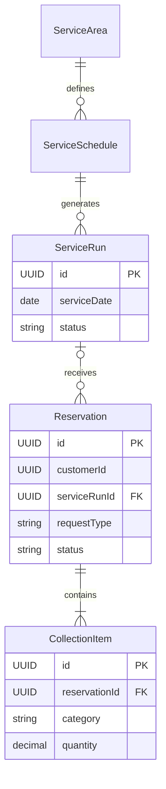
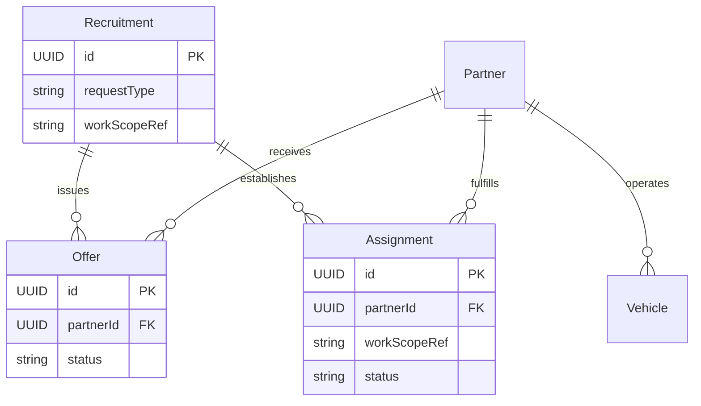
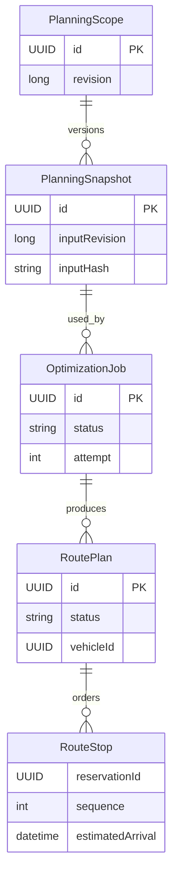
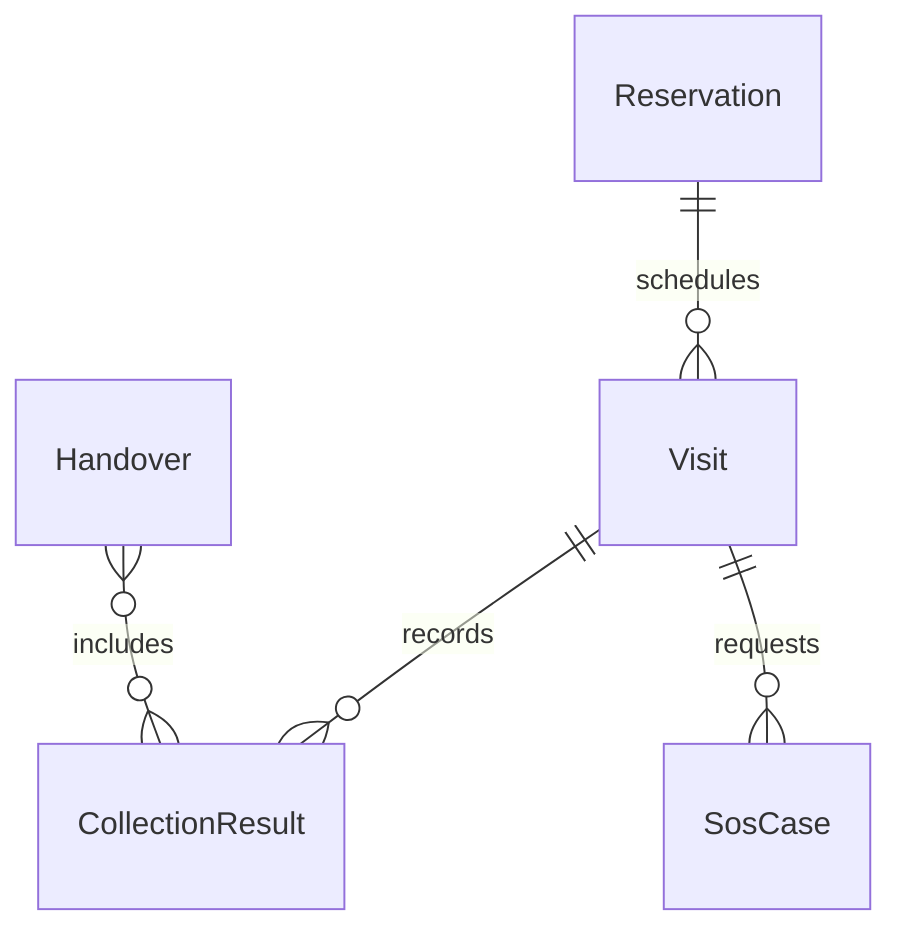

# ドメインモデル

予約、運行、業者、配車、経路計画、回収、決済を業務モジュールとする。以下のER形式の図は業務モデルの関係を表す。物理テーブルと外部キーはFlywayで定義し、クラスとの1対1対応を要求しない。

## モジュールと集約

| モジュール | 主な集約・モデル | 守る業務 |
|---|---|---|
| reservation | Reservation、CollectionItem、PickupLocation | 回収依頼の内容、変更、取消 |
| schedule | ServiceArea、ServiceSchedule、ServiceRun、BookingCapacity | 定期運行、特定日の便、予約枠 |
| partner | Partner、Vehicle、Availability | 業者所属、車両、稼働可能条件 |
| dispatch | Recruitment、Offer、Assignment | 募集、提示・応答、最終割当 |
| planning | PlanningScope、PlanningSnapshot、OptimizationJob、RoutePlan | 入力固定、計算、変更検知、候補採用 |
| collection | Visit、CollectionResult、Handover、SosCase | 訪問、回収記録、引渡し、救援 |
| payment | Payment、Refund、Settlement | 利用者支払、返金、業者報酬の精算 |

## 予約と運行

ServiceScheduleは繰返し定義、ServiceRunは特定日の運行便である。即時依頼等で便へ割り当てる前の予約を扱うため、予約の便参照は任意とする。予約を便集約の巨大な可変リストとして常時ロードせず、予約枠の確保を専用の整合性境界で制御する。

## 募集と割当

募集の対象作業、業者への提示、最終割当を分ける。`workScopeRef`は便・即時依頼・SOS等の対象範囲を表す概念上の参照であり、物理DBに無制約の汎用外部キーを置く指示ではない。採用経路は成立済みの担当条件を守る。

## 計算と経路採用

PlanningScopeの単位は1運行便とする。複数便の車両・作業を一括計算する場合は、対象scopeのIDとrevisionの組を入力に持たせる。訪問順・車両・容量・時間制約に影響する変更ではrevisionを進める。採用済み計画の変更が必要になった場合も、履歴を残して後続版を作る。

## 回収と精算

訪問、実際の回収結果、搬入・引渡しを別記録とする。SOSによる担当変更でも元の実績を保持する。支払・返金・業者精算はpaymentが別集約として管理し、利用者の支払額と業者報酬を同じ金額項目で兼用しない。

## 不変条件と排他

- 予約、支払、割当、回収、引渡しの状態を1つのstatusにまとめない。
- 同一作業への重複割当や重複決済は、業務判定・DB制約・冪等性で防ぐ。
- 最適化結果は候補として保存し、入力版と現在版が一致する場合だけ採用する。
- 集約の永続化は複数テーブルでよい。画面一覧は複数集約を読むprojectionでよい。
- 管理者の操作も同じユースケースを通し、操作者・対象・変更・理由を記録する。

予約確定時刻、返金、オファー成立、SOS報酬、容量、運行中の変更範囲、完了条件は[業務上の決定事項・Q-01〜Q-09](../../business/decisions.md)で定義する。図の多重度だけで料金や成立条件を決めない。

関連：[業務ルール](../../business/business-rules.md)、[最適化API](optimizer-contract.md)、[DB変更](database-change-policy.md)。
