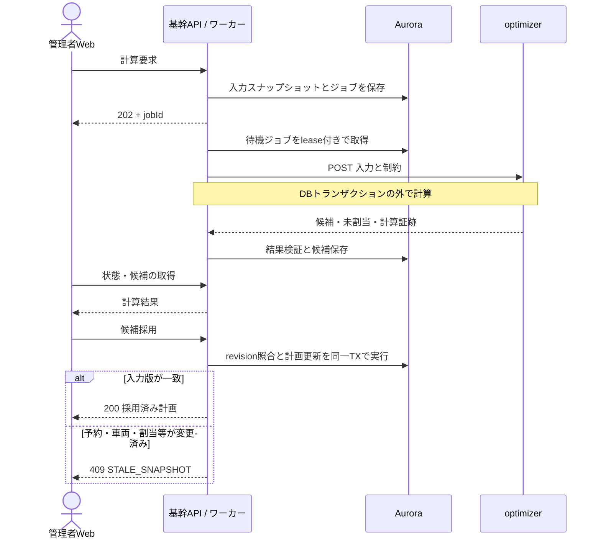
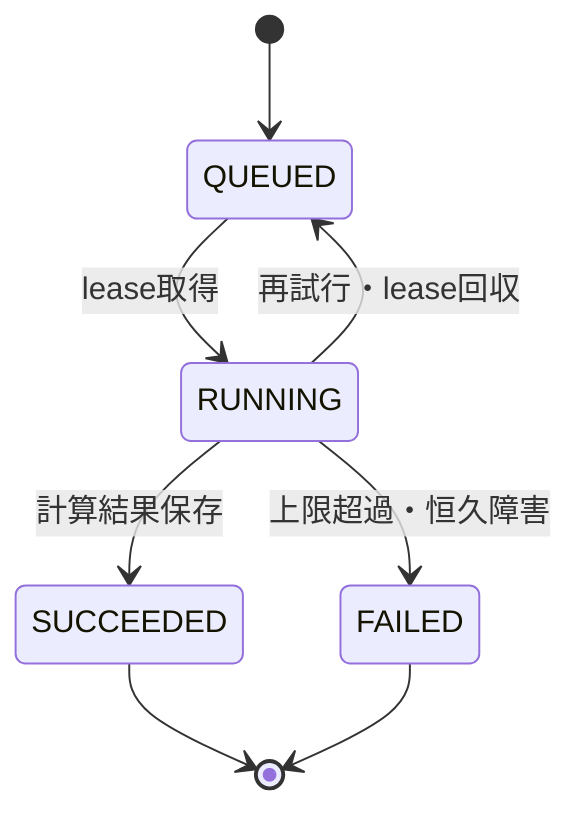

# 基幹から経路最適化へのAPI

基幹は計算ジョブと業務データを所有し、optimizerは入力スナップショットから候補を計算する。画面への受付は非同期、基幹ワーカーからoptimizerへの1回の計算依頼は時間制限付き同期RESTとする。

## 通信経路

| 項目 | 定義 |
|---|---|
| 接続 | 基幹ECS → Service Connect → optimizer ECS |
| 宛先 | `http://optimizer:8000/v1/route-optimizations` |
| 環境分離 | dev / prodで別のService Connect namespace |
| 名前・ポート | client alias `optimizer:8000`、container port `8000`、appProtocol `http` |
| ネットワーク | private subnet、optimizer SGは基幹SGからの8000のみ許可 |
| サービス認証 | 環境別の専用`X-Optimizer-Key`をSecrets Managerで管理し、FastAPIで検証 |
| 公開範囲 | CloudFront・公開ALBのルールへ最適化APIを登録しない |

内部区間はHTTPであり、Service Connectを導入するだけではTLS暗号化されない。VPC内の経路制限とサービス認証を適用する。秘密値はログ・OpenAPI例・クライアントへ出さず、新旧キーの移行期間を設けてローテーションする。ECS task roleはAWSサービスへの権限であり、このHTTP APIの認証を代替しない。

Service Connectは呼出し側をclient、optimizerをclient-serverとして構成する。optimizerのendpointを先に作成してから基幹をデプロイする。新しいendpointの追加時は呼出し側も再デプロイする。

## API一覧

| 提供側 | Method / Path | 結果 |
|---|---|---|
| 基幹admin | `POST /api/admin/v1/service-runs/{runId}/optimization-jobs` | `202`、jobId、Location |
| 基幹admin | `GET /api/admin/v1/optimization-jobs/{jobId}` | `200`、状態・候補・未割当・失敗理由 |
| 基幹admin | `POST /api/admin/v1/optimization-jobs/{jobId}/adoption` | `200`、採用計画。競合は`409` |
| optimizer | `POST /v1/route-optimizations` | `200`、計算結果。業務への採用は行わない |

管理者の計算要求・採用要求は`Idempotency-Key`を必須とし、actor・operation・キーに一意制約を設ける。同じキー・同じ入力は保存済みの要求結果を返し、異なる入力は`409`とする。業者は採用済み経路をbackyard APIで取得する。

## 処理の流れ

## 入出力

| 区分 | 項目 | 意味 |
|---|---|---|
| 識別 | requestId、snapshotId、scopeRevisions、inputHash | 要求・入力・版の対応 |
| 訪問 | visitId、locationIndex、timeWindows、serviceSeconds、demands | 訪問制約。重量・体積等の次元と単位を明示 |
| 車両 | vehicleId、start/endLocationIndex、availability、capacities、allowedVisitIds | 稼働・積載・成立済み担当条件 |
| 移動 | locations、travelSeconds、distanceMeters、matrixVersion | 同じ地点順の有向行列。到達不能を明示 |
| 計算条件 | constraintVersion、solverConfigVersion、timeLimitSeconds | 制約・計算設定の版と上限 |
| 結果 | outcome、routes、unassignedVisits | 車両別の順序・到着見込み、未割当と理由 |
| 証跡 | inputHash、solverVersion、durationMs、objectiveValue、warnings | 入力照合と計算の追跡 |

時間窓と稼働時間はタイムゾーンを含む時刻で定義し、計算時は同じ基準秒へ変換する。移動行列は基幹が取得してスナップショットに含める。optimizerが計算途中に変化する業務APIや地図APIを読み直す構成にはしない。氏名・電話番号・決済情報は送らない。

計算結果の`outcome`は次の4種類とする。実行可能解は最適性の証明を意味しない。

| outcome | 意味 |
|---|---|
| FEASIBLE | 全対象に制約を満たす候補が得られた |
| PARTIAL | 部分割当を許した計算で、未割当が残る候補が得られた |
| INFEASIBLE | ソルバーが実行不能を証明した |
| NO_SOLUTION_WITHIN_LIMIT | 時間上限までに候補も実行不能の証明も得られなかった |

入力不正は`422`、認証不正は`401/403`、同時実行枠の不足は`429`とRetry-After、サービス障害は`503`とする。正当な入力に対する実行不能・解未発見は計算結果として`200`で返す。部分割当の業務上の採用可否は基幹が判定する。

## 時間制限と実行枠

| 設定 | 値 |
|---|---|
| ソルバー計算上限 | 20秒 |
| optimizerの要求処理deadline | 25秒 |
| Service Connect perRequestTimeout | 30秒 |
| 基幹HTTPクライアント全体timeout | 35秒 |
| 同時計算数 | optimizerタスクあたり1件 |
| 基幹の再試行 | 初回＋最大1回。接続障害・429・一時的5xxのみ |

Service Connectの既定15秒をそのまま使わず、上表の値をIaCで設定する。プロキシにも再試行があるため、1回の呼出しでも重複計算が起こり得る。再試行には同じrequestIdと同じスナップショットを使うが、同じ候補が再計算されることは保証しない。

CPU計算はAPIイベントループと分離したプロセスで実行する。ソルバーの制限だけに頼らず親プロセスがdeadline超過を停止・回収し、ヘルスチェックを応答可能に保つ。上限変更は入力規模の試験と全層のtimeout見直しを同時に行う。

## ジョブの永続化と復旧

Aurora上のplanningジョブを基幹内のワーカーが取得する。leaseは60秒、実行中は10秒ごとに延長する。短い取得トランザクションでlease・attempt・worker tokenを記録し、HTTP中はDBロックを保持しない。再起動後はlease期限を過ぎたジョブを回収する。結果保存時はworker tokenを照合し、古い実行の遅延応答で上書きしない。

SUCCEEDEDは計算結果を受領した状態であり、採用済みを意味しない。INFEASIBLEも正常な計算結果として保持する。候補の採用状態は別に管理する。外部キューやoptimizer側のDBは追加せず、基幹の永続ジョブで受付と計算を分離する。

## 予約変更との整合性

1. 対象scopeのrevisionと予約・資源・制約を、同じDBスナップショットから取得して保存する。
2. 関連する予約・取消・車両・稼働・割当・計画変更は、業務更新と同じトランザクションで影響scopeのrevisionを進める。プロセス停止で通知を失う非同期処理にしない。
3. 結果のID・hash・訪問重複/欠落・担当条件・時間窓・容量を基幹が検証する。
4. 採用トランザクションでscope行をロックし、全対象revisionと入力版を比較する。複数scopeはID順にロックする。
5. 一致時だけ計画採用・revision更新・採用記録を確定する。不一致は`409 STALE_SNAPSHOT`とし、新しいスナップショットで再要求する。
6. 採用後の予約変更も計画に再計算が必要な印を付ける。古い候補で予約や担当作業を上書きしない。

[Service Connect公式](https://docs.aws.amazon.com/AmazonECS/latest/developerguide/service-connect-concepts-deploy.html)、[FastAPIの重い処理](https://fastapi.tiangolo.com/tutorial/background-tasks/)、[試験方針](../../process/testing-policy.md)。
