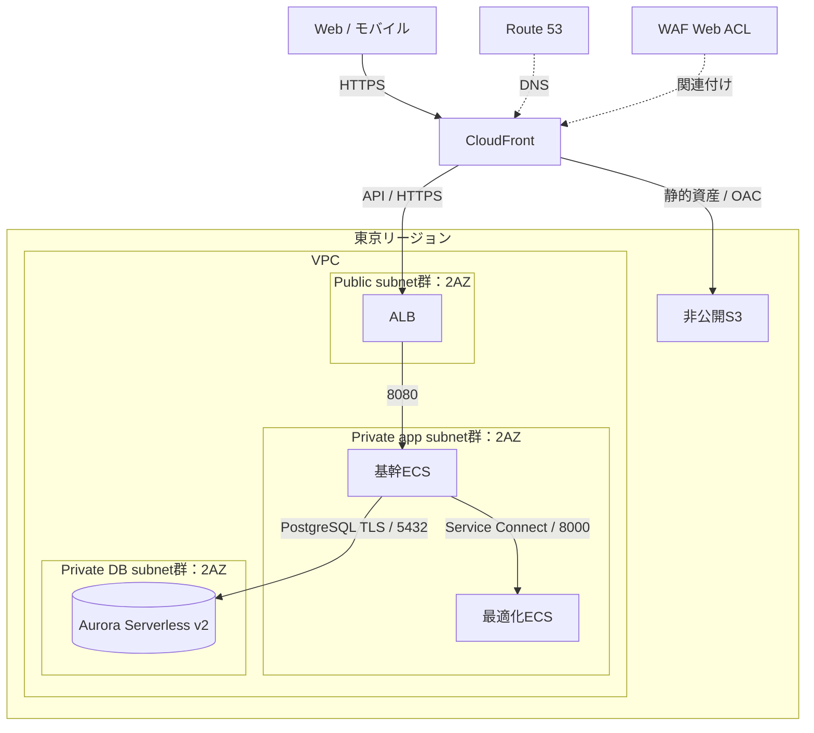
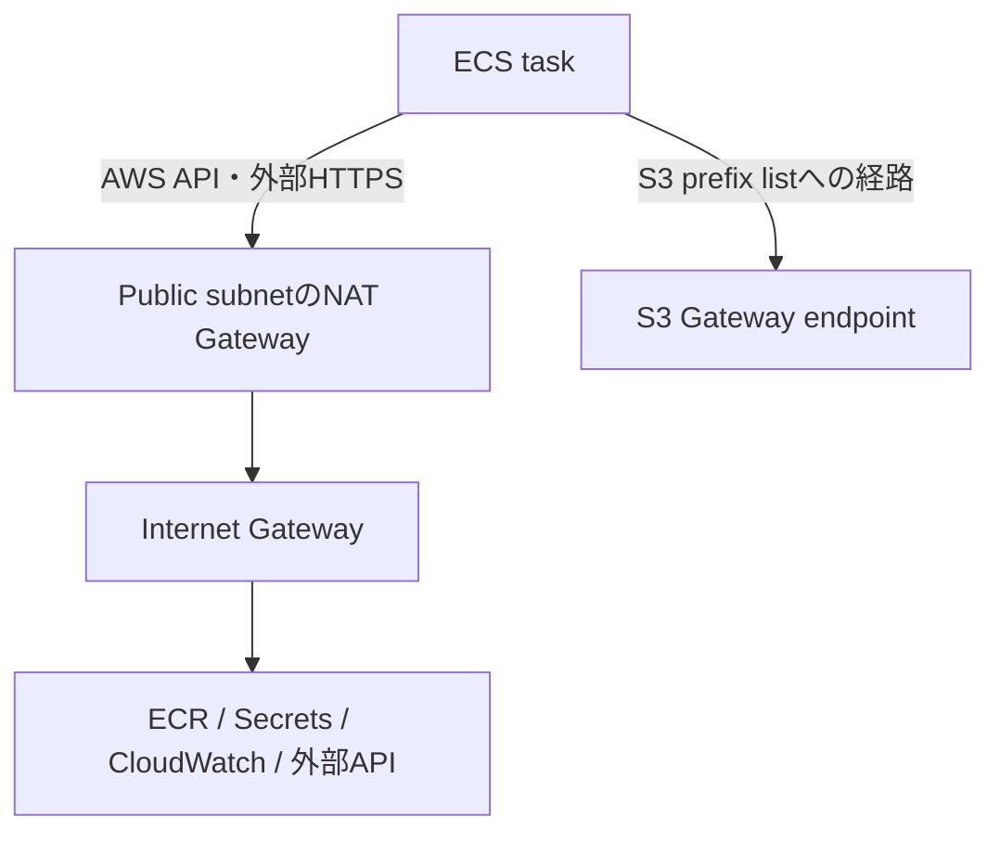

# AWSアーキテクチャ

東京リージョン`ap-northeast-1`を使用する。devとprodはVPC、ECS、Aurora、S3、秘密情報、IAM、ログを分離する。CloudFrontとRoute 53はリージョン外のグローバルサービスとして扱う。

## 配信と業務通信

subnet群は各AZに1つずつ設ける。ALBとDB subnet groupは2AZに配置する。図のECS・Auroraはサービス単位の表現であり、各AZに同数のタスクやreaderを常設する意味ではない。

### CloudFrontの振分け

| behavior | origin | 設定 |
|---|---|---|
| `/api/*` | ALB | キャッシュ無効、全必要HTTPメソッド、認証ヘッダー・必要cookie/queryを転送（Authorizationは明示的に転送するpolicyを使用） |
| 静的資産・Web入口 | 非公開S3 REST endpoint | OAC、用途別Cache-Control |

WebとモバイルのAPI入口をCloudFrontへ統一する。WAFはCloudFrontに関連付け、ネットワークの中継装置として描かない。SPAの画面URL書換えは静的配信だけに適用し、APIの401/403/404をindex.htmlへ変換しない。

ALBはinternet-facingとし、443の送信元をCloudFront origin-facing managed prefix listに制限する。さらにCloudFrontの秘密origin headerをALB listenerで照合し、不一致は固定403を返す。他のCloudFront distributionを含む直接アクセスでWAFを迂回できない構成にする。

TLS証明書はCloudFront用をACMのus-east-1、ALB用を東京リージョンに配置する。利用者の認証・業務認可はSpring Securityが担う。

## private subnetからの外向き通信

ECSはpublic IPを持たない。app subnetの外向き経路はNAT Gateway経由とし、DB subnetにはインターネット向けデフォルトルートを置かない。各環境のNATは1台から開始し、AZ障害時に外向き通信が停止する構成として運用する。

ECR image取得、Secrets Manager、CloudWatch Logsへの経路を起動時から利用可能にする。S3 Gateway endpointをapp subnetのroute tableへ関連付ける。ECR等のInterface endpoint追加はNATとの費用・トラフィック比較で決める。VPC endpointだけでは決済・地図等の外部HTTPSへ接続できない。

## Security Groupと権限

| 宛先 | 許可元 | ポート |
|---|---|---|
| ALB | CloudFront origin-facing prefix list | TCP 443 |
| 基幹ECS | ALB SG | TCP 8080 |
| optimizer ECS | 基幹ECS SG | TCP 8000 |
| Aurora | 基幹ECS SG、専用migration task SG | TCP 5432 |

optimizerにAuroraのSG許可、DB接続情報、DB資格情報の取得権限を与えない。管理者画面からのSQL直接操作も提供しない。ECS execution role、アプリtask role、CI保存ロール、CD公開ロール、migration権限を分ける。

Service Connectの認証・timeout・プロキシ資源は[最適化API](../backend/optimizer-contract.md)に従う。task CPU/memoryにはアプリに加えてService Connectプロキシの余裕を確保する。

## Auroraと最小運用構成

| 設定 | dev | prod |
|---|---|---|
| エンジン | Aurora PostgreSQL互換 | 同一互換系列 |
| Serverless v2容量 | 0.5〜2 ACU | 0.5〜4 ACU |
| writer / reader | writer 1 / reader 0 | writer 1 / reader 0 |
| 自動バックアップ | 1日 | 7日 |
| 削除保護 | 検証用途に応じて設定 | 有効 |
| ECSタスク | 基幹1 / optimizer1 | 基幹1 / optimizer1 |

DBは指定したmin/max内で自動スケールする。上限付近の継続、接続枯渇、遅延を監視し、負荷試験に基づいて上限・接続プール・計算同時数を調整する。0 ACUへの自動停止はdevの追加最適化として、対応エンジンと接続維持の影響を確認して導入する。

2AZのサブネットとAuroraストレージ冗長化だけでは、アプリ・DB計算インスタンス・NATの無停止切替を保証しない。上表は最小構成である。reader、複数ECSタスク、AZ別NATへ増やす基準はRTO/RPOと負荷測定で定める。本番開始前にPITRからの別クラスタ復元を試験する。

## ビルドと公開

CIはCodePipeline / CodeBuildからECRとCI保管S3へ不変成果物を保存する。手動開始CDが指定digestをECSへ、指定Web資産を公開S3へ反映する。ECSはnative rolling deploymentを使い、CodeDeployを必須構成にしない。DB移行は専用の単一taskで先行する。

iOSはmacOS＋Xcodeのビルド環境を使う。アプリ実行用ECSをCI環境に転用しない。[モバイル配布](mobile-delivery.md)、[デプロイ手順](../../process/deployment-runbook.md)を参照。

公式資料：[ALBの2AZ要件](https://docs.aws.amazon.com/elasticloadbalancing/latest/APIReference/API_SetSubnets.html)、[Aurora構築](https://docs.aws.amazon.com/AmazonRDS/latest/AuroraUserGuide/Aurora.CreateInstance.html)、[ALBへのアクセス制限](https://docs.aws.amazon.com/AmazonCloudFront/latest/DeveloperGuide/restrict-access-to-load-balancer.html)、[ECR VPC endpoint](https://docs.aws.amazon.com/AmazonECR/latest/userguide/vpc-endpoints.html)。
