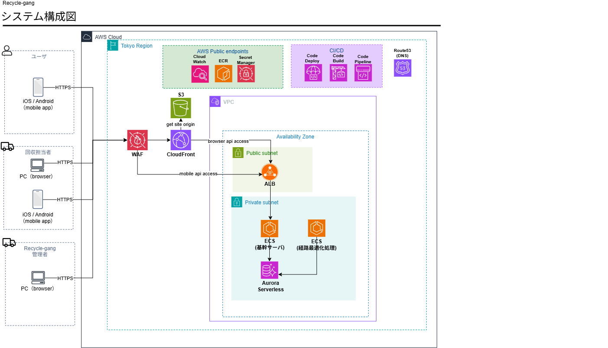

# AWS構成図レビュー：2026-10-03

ECSで基幹と計算を分け、Flutter WebをS3/CloudFrontで配信する構成を採用する。管理者Webもbackyardに含める。提出図から以下を修正し、[AWSアーキテクチャ](aws-baseline.md)を構成定義とする。

## 修正箇所

| 提出図の箇所 | 修正 | 理由 |
|---|---|---|
| optimizer ECS → Aurora | 接続を削除し、基幹 → optimizerの内部RESTを追加 | 業務データ・入力版・採用権限を基幹へ集約 |
| 1AZ内のALB / DB | ALB subnetとDB subnet groupを2AZにする | ALBとAuroraのsubnet構成要件。タスク/reader増設とは別 |
| WAFが通信経路を分岐 | CloudFrontへのWeb ACL関連付けとして描く | WAFは独立した中継ルーターではない |
| モバイルはALBへ直接接続 | モバイルもCloudFrontの`/api/*`を利用 | API入口とWAF適用を統一 |
| ALBへの公開アクセス | CloudFront prefix list＋秘密origin header＋HTTPS | CloudFront/WAFの迂回を防ぐ |
| private subnetの外向き経路なし | NAT / IGW / S3 endpointを追加 | image取得、秘密取得、ログ送信、外部API接続 |
| CloudFront / Route 53が東京内 | グローバル領域へ移動 | Route 53はDNS、CloudFrontはエッジ配信 |
| CI/CDにCodeDeploy | native ECS rollingに整理 | Service ConnectとCodeDeploy blue/greenを組み合わせない |
| S3への配信権限 | 非公開S3＋OACを明記 | 公開bucketやwebsite endpointへ依存しない |
| 管理者PC | backyard Webのadmin領域へ接続 | 管理者専用APIと権限で操作する |

ALBへ直接接続する経路を将来追加する場合、その経路にもregional WAF等の防御が必要になる。採用構成では直接経路を作らない。

## 図に追記する運用上の境界

- dev / prodの資源・秘密・ログを分ける。
- CI保管S3とCloudFront公開S3を分ける。
- DB変更はmigration task、通常業務更新は基幹ECSだけに許可する。
- ログイン認証、API認可、サービス認証をネットワーク制御と区別する。
- AuroraのACUスケールと、ECSタスク数・reader・NATの冗長化を区別する。
- CloudFront用ACM証明書と、東京ALB用ACM証明書を配置する。

## 修正版と提出原本

[修正版drawio](aws-architecture-recycle-gang.drawio)に、レビュー事項を反映した。公開・業務通信、外向き通信、CI/CDの3ページで構成し、図形・文字・接続線を編集できる。

以下は提出時の原本として保存する。

[drawio原本](reviews/2026-10-03/aws-architecture-recycle-gang.drawio)

## 根拠

- [ALB subnet要件](https://docs.aws.amazon.com/elasticloadbalancing/latest/APIReference/API_SetSubnets.html)
- [Aurora network設定](https://docs.aws.amazon.com/AmazonRDS/latest/AuroraUserGuide/Aurora.CreateInstance.html)
- [WAFの関連付け](https://docs.aws.amazon.com/waf/latest/developerguide/web-acl-associating-aws-resource.html)
- [CloudFrontからALBへのアクセス制限](https://docs.aws.amazon.com/AmazonCloudFront/latest/DeveloperGuide/restrict-access-to-load-balancer.html)
- [Service Connectの設定と制約](https://docs.aws.amazon.com/AmazonECS/latest/developerguide/service-connect-concepts-deploy.html)
- [ECRのprivate接続](https://docs.aws.amazon.com/AmazonECR/latest/userguide/vpc-endpoints.html)
