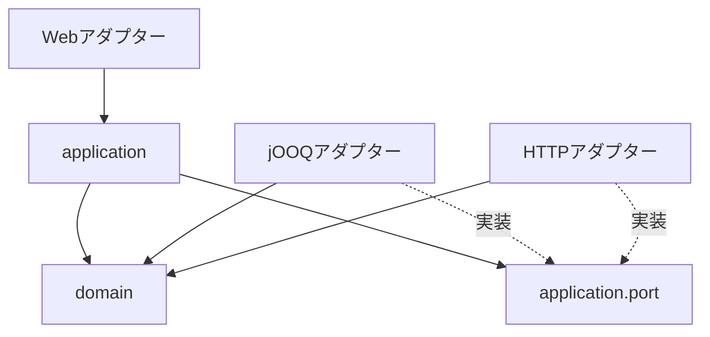

# フォルダ構成と依存方向

以下を実装の配置規約とする。生成物は再生成で置き換え、手修正しない。

## recycle-gang

```text
recycle-gang/
├── backend/
│   ├── src/main/java/com/recyclegang/backend/
│   │   ├── reservation/      # 予約
│   │   ├── schedule/         # 地域・運行便・予約枠
│   │   ├── partner/          # 業者・車両・稼働条件
│   │   ├── dispatch/         # 募集・オファー・割当
│   │   ├── planning/         # 計算ジョブ・候補・経路採用
│   │   ├── collection/       # 回収・引渡し・SOS
│   │   └── payment/          # 支払・返金・精算
│   ├── src/main/resources/db/migration/
│   ├── src/test/
│   ├── db/
│   │   ├── fixtures/         # 開発・試験専用データ
│   │   └── maintenance/
│   │       └── YYYY-MM-DD_purpose/
│   │           ├── README.md
│   │           ├── precheck.sql
│   │           ├── apply.sql
│   │           └── postcheck.sql
│   └── build/generated/     # jOOQ・OpenAPI生成Java
├── flutter/
│   ├── lib/
│   │   ├── app/              # 起動・ルーティング・認証
│   │   └── features/
│   │       └── reservations/
│   │           ├── presentation/
│   │           ├── application/
│   │           └── data/
│   ├── packages/consumer_api/
│   ├── test/
│   └── integration_test/
├── contracts/
│   ├── openapi/
│   │   ├── consumer.yaml
│   │   ├── backyard.yaml
│   │   ├── admin.yaml
│   │   └── components/
│   └── generator/            # 生成器・設定・取得版の固定
├── infra/                    # Terraform、dev/prod別state
├── ci/                       # buildspecと検証・配布スクリプト
└── doc/
    ├── business/
    ├── architecture/
    ├── process/
    └── reference/
```

## 業務モジュールの内部

`reservation`を例とする。同じ構造を各モジュールに適用し、必要なアダプターだけを置く。

```text
reservation/
├── ReservationFacade.java   # 他モジュールに公開する入口
├── ReservationId.java
├── ReservationChanged.java  # 公開する業務イベント
├── domain/                   # 集約・値オブジェクト・業務ルール
├── application/
│   ├── command/              # 更新ユースケース
│   ├── query/                # 参照ユースケース・表示用projection
│   └── port/                 # repository・外部連携のインターフェース
└── adapter/
    ├── in/web/               # Controller・API DTO変換
    └── out/
        ├── persistence/      # jOOQとドメインの変換
        └── integration/      # 外部サービス接続
```



矢印はコードの依存を表す。domainはSpring・jOOQ・HTTP・生成API DTOへ依存しない。DIでportにアダプターを接続する。

## モジュール境界

- 他モジュールには公開facade・ID・イベントだけを見せる。内部domainやrepositoryを直接参照しない。
- Spring Modulithのモジュール検出を設定し、生成コードと起動設定を業務モジュールから除外する。循環依存と内部参照をCIで検出する。
- テーブルの更新は所有モジュールが担当する。横断参照SQLは明示したqueryアダプターに置き、参照テーブルを試験対象として記録する。
- 同一DBで同時確定すべき変更は同期処理とトランザクションで結ぶ。外部HTTPはその外で実行する。
- 業務変更による計画revision更新は同一トランザクションの同期イベント処理で行う。外部通知の配信保証には永続outboxを使う。
- 共通化はID・時刻・エラー等に限定し、業務ロジックをsharedへ集約しない。

## recycle-gang-backyard

```text
recycle-gang-backyard/
├── flutter/
│   ├── lib/
│   │   ├── app/
│   │   └── features/
│   │       ├── provider/     # 業者：オファー・担当回収・SOS
│   │       └── admin/        # 管理者：運行・割当・経路・監査
│   ├── packages/
│   │   ├── backyard_api/
│   │   └── admin_api/
│   ├── test/
│   └── integration_test/
├── ci/
└── doc/
```

業者はWeb/モバイル、管理者はWebを対象とする。管理者機能は同じFlutterプロジェクト内の独立featureとし、API契約と権限を分離する。

## recycle-gang-optimizer

```text
recycle-gang-optimizer/
├── src/recycle_gang_optimizer/
│   ├── api/                  # FastAPI・認証・DTO検証
│   ├── application/          # 計算実行・時間制限・並列数制御
│   ├── domain/               # 訪問・車両・制約・計算結果
│   └── adapters/solver/      # ソルバーとの変換
├── contracts/openapi/optimizer.yaml
├── tests/
│   ├── unit/
│   ├── solver/
│   └── contract/
├── ci/
├── doc/
├── pyproject.toml
└── uv.lock
```

ジョブ永続化は基幹のplanningに置く。optimizerには業務DBアダプターを置かない。
