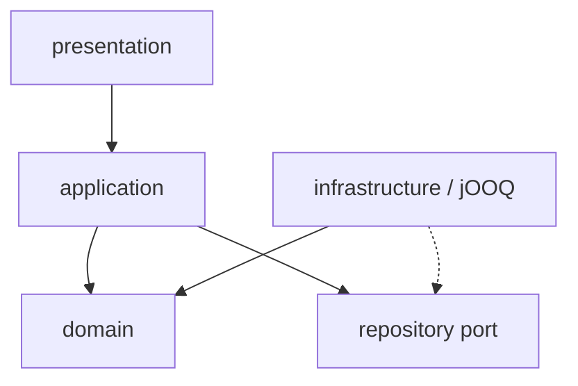

# フォルダ構成と依存方向

以下を実装の配置規約とする。生成物は再生成で置き換え、手修正しない。


## recycle-gang v0.1

```text
recycle-gang/
├── compose.yaml                          # PostgreSQLだけを起動
├── backend/
│   ├── gradlew / gradlew.bat
│   ├── src/main/java/com/recyclegang/backend/
│   │   ├── customer/                     # プロフィール・住所
│   │   ├── catalog/                      # 施設・品目・受付枠
│   │   ├── reservation/                  # 予約・入場・写真・持込完了
│   │   ├── configuration/                # DI・local認証
│   │   └── shared/                       # 業務エラー・認証主体
│   ├── src/main/resources/
│   │   ├── db/migration/                 # Flyway DDL
│   │   ├── db/local/                     # local専用fixture
│   │   └── static/local/                 # 管理人の受付テスト画面
│   ├── src/generated/java/               # jOOQ生成型
│   ├── generated/src/main/java/          # OpenAPI生成interface・DTO
│   └── src/test/                         # 状態・セキュリティ・DB結合
├── flutter/
│   ├── lib/
│   │   ├── app/                          # 起動・テーマ・ルーター
│   │   ├── core/                         # API・モック・下書き・共通UI
│   │   └── features/
│   │       ├── home/
│   │       ├── booking/
│   │       ├── activity/
│   │       └── profile/
│   ├── packages/recycle_gang_api/        # 生成Dart Dio SDK
│   ├── test/                             # 画面フロー・モック契約
│   └── tool/api_smoke.dart               # 実HTTPのSDK疎通
├── contracts/
│   ├── openapi/                          # consumer・backyard・共通型
│   └── templates/dart/                   # 生成器のmultipart対応
├── scripts/generate-contracts.py
├── ci/buildspec.yml                      # 検証と成果物保管。公開なし
└── doc/
```

## 業務モジュールの内部

```text
reservation/
├── domain/                               # Booking・状態遷移
├── application/                          # BookingService・repository port
├── infrastructure/                       # jOOQ実装・QR暗号化
└── presentation/                         # 生成APIの実装・DTO変換
```



domainはSpring・jOOQ・HTTP・生成DTOに依存しない。他モジュールへはapplicationの公開サービスを通す。他モジュールのrepositoryやinfrastructureを直接参照しない。更新トランザクションはapplicationで管理する。

生成JavaとDart SDKはコミットする。新規cloneの起動にコード生成環境を要求しない。再生成は契約・スキーマ変更時に実施する。

運行・募集・配車・最適化・業者実績・実決済のモジュールは[ドメインモデル](backend/domain-model.md)に定義する。実行しない空フォルダや空クラスは作らない。

## recycle-gang-backyard

```text
recycle-gang-backyard/
├── flutter/
│   ├── lib/
│   │   ├── app/
│   │   └── features/
│   │       ├── provider/     # 業者：オファー・担当回収・SOS
│   │       └── admin/        # 管理者：運行・割当・経路・監査
│   ├── packages/
│   │   ├── backyard_api/
│   │   └── admin_api/
│   ├── test/
│   └── integration_test/
├── ci/
└── doc/
```

業者はWeb/モバイル、管理者はWebを対象とする。管理者機能は同じFlutterプロジェクト内の独立featureとし、API契約と権限を分離する。

## recycle-gang-optimizer

```text
recycle-gang-optimizer/
├── src/recycle_gang_optimizer/
│   ├── api/                  # FastAPI・認証・DTO検証
│   ├── application/          # 計算実行・時間制限・並列数制御
│   ├── domain/               # 訪問・車両・制約・計算結果
│   └── adapters/solver/      # ソルバーとの変換
├── contracts/openapi/optimizer.yaml
├── tests/
│   ├── unit/
│   ├── solver/
│   └── contract/
├── ci/
├── doc/
├── pyproject.toml
└── uv.lock
```

ジョブ永続化は基幹のplanningに置く。optimizerには業務DBアダプターを置かない。
