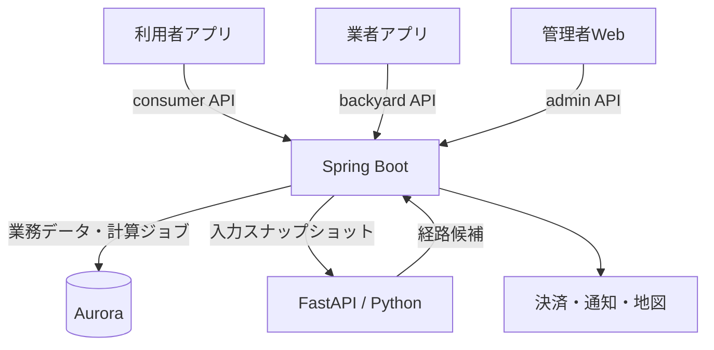

# システム構成と責務

## リポジトリ境界

| リポジトリ | 所有するもの | 接続先 |
|---|---|---|
| recycle-gang | 利用者Flutter、Spring Boot、業務モデル、業務DB、Flyway、基幹OpenAPI、共通設計・IaC | optimizer、決済・通知・地図等 |
| recycle-gang-backyard | 業者向けFlutter Web/モバイル、管理者向けFlutter Web、生成SDK | 基幹backyard / admin API |
| recycle-gang-optimizer | FastAPI、計算モデル、ソルバーアダプター、最適化OpenAPI | 基幹から受け取った入力を計算して返す |

基幹は業務モジュールを内包する1つのデプロイ単位とし、1つの論理DBを利用する。optimizerは計算負荷と障害を基幹から分離する独立したECSサービスとする。

## データ所有と確定権限

基幹が予約・募集・業者割当・実績・支払・採用済み経路を所有する。利用者・業者・管理者は同じ業務を異なる権限で操作する。画面ごとに別の業務サーバーやDBを持たない。

計算入力・ジョブ状態・候補・採用履歴も基幹で保存する。optimizerはステートレスな計算サービスであり、Auroraへの接続権限を持たない。再送による重複計算は許容し、重複した業務反映は基幹で防ぐ。

## 依存方向

- Flutter → 用途別生成SDK → 基幹のAPIアダプター → 業務ユースケース。
- 基幹のplanningユースケース → 最適化ポート → 生成HTTPクライアント → FastAPI。
- FastAPI → 計算ユースケース → 計算モデル。ソルバーは外側のアダプターとして実装する。
- API契約は提供側が所有する。利用側は版とハッシュを固定して取得する。

詳細：[ドメインモデル](backend/domain-model.md)、[最適化API](backend/optimizer-contract.md)、[画面と権限](ui/application-boundaries.md)。
