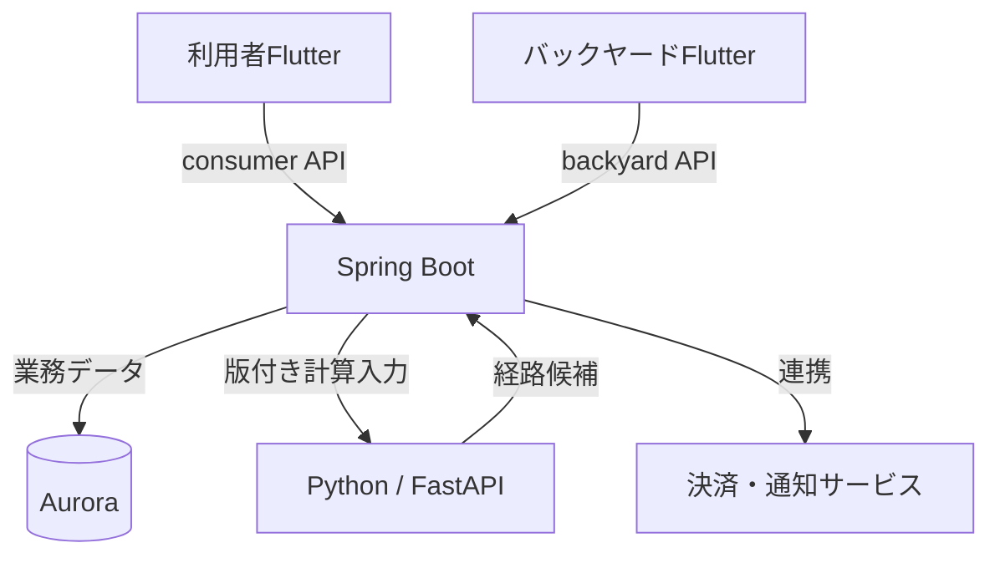

# システム・リポジトリ境界

更新日：2026-10-03。責務・通信方針は合意済み。詳細実装は提案。

## 責務

| リポジトリ | 所有するもの | 接続先 |
|---|---|---|
| recycle-gang | 利用者Flutter、Spring Boot、業務モデル、業務DBとFlyway、基幹OpenAPI、全体方針 | optimizer、決済・通知等の外部アダプター |
| recycle-gang-backyard | 業者・運営向けFlutter、Web/モバイル画面、画面状態、生成SDK | 基幹backyard API |
| recycle-gang-optimizer | Python計算、FastAPI、最適化契約、計算ジョブ | 初期案はSpring Bootから呼ばれる。業務DBには接続しない |

リポジトリ、業務領域、デプロイ単位は別の境界である。基幹は初期1アプリケーション・1論理DB。optimizerは別プロセス／ECSワークロードとする。利用者／業者／運営は業務データの所有者を分ける根拠にせず、権限と公開DTOを分ける。

## 所有と確定

予約・募集・業者割当・回収実績・採用済み配送計画の正はSpring Boot側。optimizerは車両割当も含めた候補を計算できるが、業者契約や予約確定を更新しない。候補の採用可否は基幹が判定し、採用済みの順序をバックヤードへ返す。

optimizerの計算入力・結果・ジョブ状態の保存は許容するが、業務DBの共有はしない。計算状態の永続化方式は非同期化時に決める。Python固有の計算モデルにJavaドメインクラスの全構造を複製しない。

## 初期の依存方向

- Flutter → 生成API SDK → 基幹API。
- Spring Bootの配送計画ユースケース → 最適化ポート → HTTPアダプター → FastAPI。
- FastAPI → Python計算サービス → 計算モデル／ソルバー。
- 最適化の入力取得・業務更新のためのPython → Spring Boot呼出しは初期の必須要件にしない。必要になればinternal APIとして追加する。
- OpenAPI仕様をコピーして独立編集しない。提供側リポジトリの版付き契約を取得し、利用側で取得版・ハッシュを固定する。

責務の根拠は [業務要件](../business/requirements.md)、[API契約](backend/api-contract-policy.md)、[最適化連携](backend/optimizer-contract.md)。
