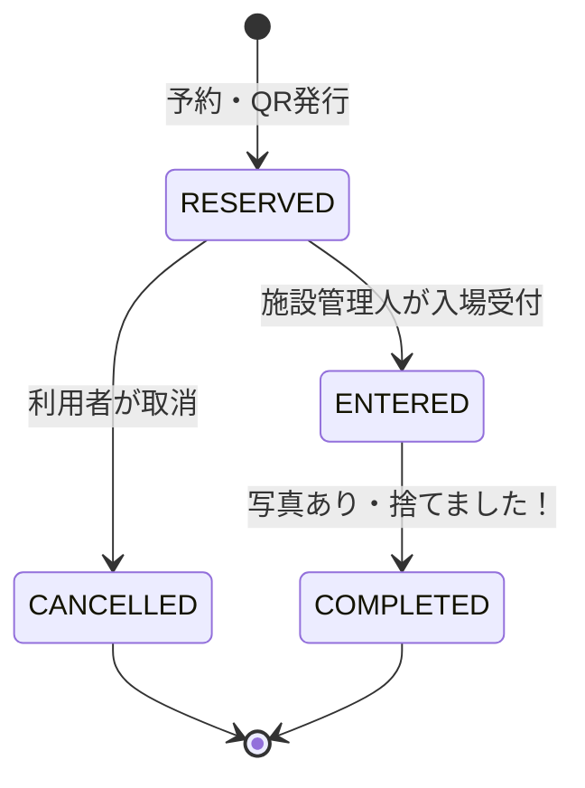

# ユースケース v0.1

画面・API・DBを一緒に変更する。画面の配置はFlutter実装を定義とし、重複する画面仕様書は作らない。

| 利用者の目的 | 画面 | ユースケース / API |
|---|---|---|
| 状況を知る | ホーム・やること・お知らせ・アクティビティ | 自分の予約一覧 `GET /reservations`。やることとお知らせは予約状態から表示する |
| 持込を予約する | 依頼方法 → 回収品 → 施設詳細・地図 → 日時 → 確認 → 完了 | カタログ `GET /catalog`、予約 `POST /reservations` |
| 訪問回収を予約する | 依頼方法 → 回収品 → 住所・都道府県 → 日時 → 確認 → 完了 | 同じ予約ユースケース。`mode=PICKUP`、自分の住所IDを指定する |
| 入力を再開する | 下書き → 予約作成 | 端末に1件保存。モックと実APIの下書きは別キー |
| 予約内容を確認・取り消す | アクティビティ詳細 | `GET /reservations/{id}`、`POST /reservations/{id}/cancel` |
| 入場する | 入場QR | `GET /reservations/{id}/ticket`。管理人が `POST /api/backyard/v1/admissions` で記録 |
| 持込を終える | アクティビティ詳細 → 写真 → 捨てました！ | 写真 `POST /reservations/{id}/photos`、完了 `POST /reservations/{id}/complete` |
| 連絡先・回収先を管理する | マイページ → プロフィール・住所編集 | `GET/PUT /profile`。予約時に住所を複製し、住所編集で既存予約を変えない |
| 金額を確認する | 料金・支払い方法・取引履歴 | カタログ料金と予約時の単価・合計。取引詳細は予約詳細に集約する |

表のconsumer APIは `/api/consumer/v1` を省略している。地図ボタンは外部地図サービスを開く。都道府県選択は住所編集の中に配置する。

## 持込の業務規則

- 予約とユーザーに対応するQRを1つ発行する。QRの表示は入場記録ではない。
- QRは256ビットの乱数を含む不透明なトークン。氏名・住所・ユーザーIDを埋め込まない。
- DBには照合用SHA-256と再表示用AES-256-GCM暗号文を保存する。予約IDを認証付き暗号の追加データに使う。
- 管理人の施設、予約状態、日本時間の受付枠を照合する。受付枠の開始を含み、終了は含まない。
- 入場受付は予約行のロックと予約IDの一意制約で重複を防ぐ。同じQRの再読取は「受付済み」を返し、記録を増やさない。
- 入場後だけ写真を登録できる。1〜5枚、JPEG/PNG、入力8MB以下・2000万画素以下。サーバーで画像内容を検査し、JPEGに再符号化してEXIF/GPSを保存しない。
- 「捨てました！」で終了する。施設から出るときの受付はない。写真は予約所有者だけが取得できる。
- 入場後の取消、取消済み・期限切れ・完了済みQRの入場利用を拒否する。入場後の写真・完了操作には受付枠の終了時刻を再適用しない。
- 予約送信は利用者と`clientRequestId`の組で冪等にする。同じIDで内容が変われば409。同じ完了・取消の再送も記録を増やさない。

## ローカル版の業務境界

料金、全日受付枠、2施設は動作確認用のカタログ。予約時に `TEST_PAID`、取消時に `TEST_REFUNDED` を記録する。外部決済・実請求を行わない。訪問回収は予約・照会・取消を提供し、利用者自身による回収完了操作は設けない。

会員はデモ利用者を1名用意する。プロフィール編集は認証情報の変更ではない。外部IdPの会員登録・ログイン、決済事業者、業者の回収実績・運行・最適化はv0.1の実行範囲に含めない。

元の[業務決定事項 Q-01〜Q-09](decisions.md)は引き続き個別に扱う。今回確定した持込完了条件を、業者による訪問回収・引渡しの完了条件と混同しない。
