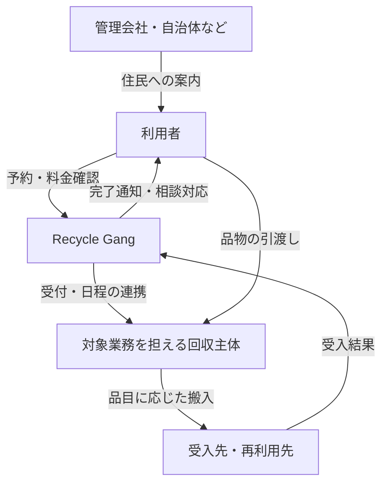

# 届け方・提携戦略の調査と提案

- 調査日：2026-10-04
- 位置づけ：本人の[指針](2026-10-04-go-to-market-principles.md)に対する調査・提案。採用済みの業務仕様や実装を変更する文書ではない。
- 対象：日本国内の家庭向け不用品回収。具体的な許可・料金・搬入条件は、開始自治体と品目を決めて確認する。

## 提案の要点

小さな地域で利用者の信頼と回収実績を作り、隣接地域へ広げる方針を支持する。提携先は会社の大きさよりも「処分したい人に、必要な時、近い地域で案内できるか」で選ぶ。

最初の組み合わせとして、地域に物件を持つ管理会社・住宅事業者による案内、対象地域・品目を扱える回収事業者、受入先を提案する。自治体には制度・搬入条件の確認と、公共的な効果を持つ小規模実証を並行して相談する。以下の順位・事業設計は調査からの推論であり、提携先の受諾や収益性を確認した結果ではない。

「公共か民営か」は一社で全てを解決する二択にしない。必要なのは、利用者との接点、回収の実行能力、受入先の三つをつなぐこと。

これは役割図。RG が無条件に廃棄物処理を元請受託・再委託できることを示すものではない。誰が利用者との処理契約を結ぶか、誰が代金を受け取るかは実際の許可・委託関係と合わせて定める。

## 参考になる既存の仕組み

| 一次資料で確認した事例 | 借りられる考え方 | 同じだと扱わない点 |
|---|---|---|
| 東大和市：粗大ごみの申込ページでジモティーを案内。[1] | 処分を考えた瞬間に、既存窓口から選択肢を提示する | 民間サービスの案内と、市の収集業務・料金の変更は別 |
| 三井不動産レジデンシャル×マーケットエンタープライズ：マンション共用部の出張買取を試行し、2025年8月に業務提携。住民への周知と定期的な催事を組み合わせる。[2] | 管理・居住の接点を通じ、一か所に需要を集める | 買取の事例。売れない廃棄物の有料回収まで成立した証拠ではない |
| SGムービング×リネットジャパン×自治体：家電回収を住民へ案内。公式説明では収集運搬許可を持つ事業者が訪問する。[3] | 自治体の信頼、受付、回収、リサイクル先を分担する | 普通の宅配便が何でも回収できる仕組みではない。家電の制度・品目に依存 |
| ニトリ：家具の配送に引取りを組み合わせ、数量・容量・住所等に条件を設ける。[4] | 買替え時の処分需要を捉え、車両容量と作業範囲を先に絞る | 独立した不用品回収とは条件も原価も異なり、表示価格だけを比較できない |

提携発表やサービスの存在は確認できるが、これらの公開資料から利益率や顧客獲得費用は確認できない。成功事例の売上・採算を推定して事業計画へ転記しない。

## 回収主体と届け先を先に成立させる

家庭から出る廃棄物の回収には、原則として市区町村の一般廃棄物処理業の許可や委託が必要。産業廃棄物処理業・古物商の許可だけでは代わりにならない。[5] 品目や制度に応じた例外・認定はあるが、通常の運送資格、車両の保有、アプリへの登録だけで家庭ごみを回収できるわけではない。

このため「ドライバーを募集する」は、少なくとも次の二つに分ける。

- 対象自治体・品目を扱える事業者の運行能力を確保する。
- その事業者の適法な運営体制の中で、人員・車両を確保する。

一般廃棄物処理業には再委託や名義貸しの規制もある。[6] 許可業者の名前だけを借り、別の個人事業者を自由に配車する設計にはしない。許可の有効期間だけでなく、家庭系の対象品目、区域、使用車両、搬入先、実際の指揮・契約関係を確認する。新規許可を原則出していない自治体もあり、例えば富良野市はその方針を明示している。[7] 自社取得を当然の前提には置けない。

本人の「顧客を取り合う回収ブランドを集客の柱にしない」という問題意識は理解できる。ただし、**同じ顧客接点を争う提携と、回収能力を提供してもらう業務連携は区別したい**。後者まで排除すると、実行主体を確保する選択肢を狭める。相手にとっての価値は、予約済みのまとまった仕事、移動・見積り負担の削減、確実な精算にある。この見直しは提案であり、本人の原文は変更していない。

届け先は「ゴミセンターを一つ見つける」だけでは決まらない。品目ごとに再利用先、一般廃棄物の受入先、家電リサイクル等の処理経路を割り当て、受入条件・費用・営業日時・拒否時の対応を確認する。再利用できると想定した品が売れない場合も含めて成立させる。使用済家電は、無料引取り・安価な買取という名目だけで有価物になるわけではない。[8]

## 公共との提携：四つの契約を混ぜない

| 形 | 誰から何の対価を得るか | 評価 |
|---|---|---|
| 住民への案内・紹介 | 自治体からの支払いを前提にせず、別途成立するサービス収益 | 既存の住民接点に入る入口。ただし選定・掲載条件は必要 |
| 受付・配車・運営のシステム提供 | 自治体や運営事業者から、システム・運営支援の対価 | 定額・従量を組み合わせられる。自治体別の個別開発が増えると採算が崩れる |
| 収集等の業務委託 | 自治体から、定めた業務を履行する対価 | 仕様、価格、責任、予算・調達手続きを伴う |
| 民間サービスによる施設利用 | サービス収入から、認められた搬入・処理の費用を払う | 搬入できる主体・品目等の確認が先。施設への支払いだけでは営業できない |

スタートアップ支援、住民への案内、処理業務の委託、施設の受入れはそれぞれ別の判断事項。自治体が保有する住民情報を、そのままRGの見込み客リストとして利用できるという意味でもない。初期接点は自治体や管理会社による案内と、利用者自身の申込みを基本にする。

自治体向けのシステム利用料は、スケールしないとは限らない。価格体系・運用手順・データ形式を共通化し、区域・品目・料金表を設定で差し替えられれば横展開できる。一方、自治体ごとの個別受託開発にすると、営業件数の増加に伴って開発・保守も増える。この違いを見たい。

成果報酬には、内閣府が推進するPFS（成果連動型民間委託契約方式）という参考枠組みがある。[9] ただし、今回と同じ不用品回収事業の採用実績を確認したという意味ではない。「増えた利用者数」だけでなく、受付負荷、未回収、適正な再使用、住民の手間など、自治体と合意できる成果を設定する案を提案する。比較対象、測定方法、報酬上限、既存事業からの単なる移行の扱いも必要。

利用者が増えても、収集費用が増えれば利益は増えない。住民料金が処理の全原価を回収しているとも限らない。よって「増えた料金収入の一定割合」がそのまま成果報酬の原資になるとは置かない。測定・契約が複雑になる初回実証では、範囲と金額を決めた実証契約の方が検証しやすい、というのが本メモの提案。

## 価格の自由度は民間でも確認が必要

廃棄物処理法第7条第12項は、一般廃棄物収集運搬業者・処分業者の料金について、条例による手数料相当額を超える徴収を制限している。[10] 適用する条例・業務・料金項目は開始地域で確認する。市の粗大ごみ処理券の額があらゆる作業の総額上限と直結する、と単純化するのも適切ではない。

室内搬出、受付、収集運搬、処分、システム提供などの実際の業務と対価を整理する。名目を「アプリ利用料」等に変えれば自由に上乗せできるとは解釈しない。自治体担当部署と当該分野の専門家に、具体的な契約・料金案を確認してから公開する。

利用者には最終的な総額、含まれる作業、追加費用が生じる条件を予約前に示す。明快さは一律価格と同義ではない。写真、寸法、階段、搬出位置を必要最小限だけ確認し、現場での想定外の追加請求を減らす。

## 民間候補の優先順位

以下は提案順位。公開された提携募集や、各社がRGとの提携を希望しているという情報ではない。

| 候補 | 主に得られるもの | 最初に確認すること |
|---|---|---|
| 地域の管理会社・住宅事業者・管理組合 | 近接した住民への案内、退去・片付けの需要 | 案内できる世帯数、担当者、共用部利用条件。管理会社と管理組合の権限を区別 |
| 引越し・家具販売・住み替え関連事業者 | 処分需要が顕在化した時の接点 | 既存サービスが拾わない品目・日程、紹介の便益、既存契約との競合 |
| 生協・地域の生活支援サービス | 地域内の継続的な顧客接点 | 案内先としての適合性。食品等の配送と同じ車両で運べるとは想定しない |
| 配送会社・運送コミュニティ | 車両・人員・運行ノウハウ | 廃棄物を扱う根拠、荷室・作業員数、搬入先、既存配送への影響 |
| 中古トラック販売・レンタル事業者 | 車両の調達 | 稼働見込みと保有費。利用者の獲得や受入先の確保には別の相手が必要 |

「ドライバーが顧客宅へ行くこと」は集客パートナーの必須条件にはしない。需要の発生を把握できることと、地域内でまとまった予約を作れることを優先する。配送の帰り便を使う場合も、積載容量、汚れ、二人作業、滞在時間、処分場への迂回を含めて比較し、空きスペースを無料の能力と見なさない。[4] の引取り条件は、容量制約を先に設計する具体例になる。

相手への提案は役割ごとに変える。管理会社には住民対応・退去時の困りごとの軽減、回収主体には収益の読める仕事、受入先には事前に分別・数量が分かる搬入を提示する。紹介数だけ増えて相手の苦情対応が増えるなら、提携は続かない。

## 評判と採算を同時に検証する

評判を育てるには、最初に知ってもらう経路を用意する。提携先から対象住民への案内、建物内掲示、完了後の任意の紹介は、地域限定の方針と両立する。実績がない段階の誇大な発信はしない。

大型不用品を同じ家庭が頻繁に出すかは未確認。継続性は、同じ家庭の毎月利用だけでなく「地域全体から定期的に予約が集まるか」で測る。ここでいう定期便は運行頻度であり、利用者の月額契約を当然には意味しない。

ユーザー視点で評価するのは、価格の分かりやすさ、約束した日時の履行、回収不能時の説明、問い合わせへの応答。アプリのダウンロード数だけでは、この体験が成立したか分からない。

利用者が比較するのは自治体の収集、買替え時の引取り、買取・譲渡など。東大和市は既にインターネット受付やLINEからの手続きも案内している。[1] RGの価値は「アプリで予約できる」より具体化する必要がある。例えば「退去までに間に合う」「料金が先に決まる」「分からない品目も迷わず出せる」のうち、どの困りごとに対価が払われるかを実証で見極める。

採算は一件ごとに加えて一便単位で見る。

> 一便の貢献利益 ＝ その便に帰属する売上 − 回収委託・人員費 − 車両・移動費 − 搬入・処理費 − 決済・紹介費 − 返金・再訪・問い合わせ対応費

委託費に車両費等が含まれる場合は二重計上しない。買取を行う場合は買取代金・販売費・売れ残りも別途織り込む。これは固定費・開発費を引く前の指標であり、会社の利益とは区別する。創業者が無償で対応した時間も通常の人件費で換算し、必要な運転資金も確認する。

採用するなら、回収主体には最初は便単位の最低保証と明確な作業条件を相談したい。直前の募集だけに依存せず、確保した能力の範囲で予約枠を売る。既存の週3回程度という構想は、実証では需要・採算との適合を検証する。今回の提案だけで公開頻度の仕様を変更しない。

## 初回実証の提案

1. 自治体を一つ、隣接する住宅エリアを一つ選ぶ。10〜15世帯程度に、直近の処分品・実際の支払額・面倒だった手順・予約しなかった理由を聞く。人数は実証案であり業界基準ではない。
2. 受入先と回収主体を確保し、扱う品目・搬出範囲・総額を限定する。判断の難しい品目は開始対象に入れない。
3. 案内役を一社または一団体に絞り、例えば4〜6週間に2〜4回の有料回収日を設定する。期間・便数は提案値。予約を受けた後に需要不足を理由として取り消さないよう、便の実行条件と予算を先に決める。
4. 各便で、案内世帯数→予約数→回収完了数、地域別・便別の件数、定時率、追加請求・拒否・再訪、苦情、搬入費、一便の貢献利益を記録する。非利用者にも理由を聞く。
5. 開始前に決めた品質・採算の基準で継続を判断する。密度不足なら頻度や案内経路、採算不足なら品目や作業範囲を調整し、同条件で再検証する。成立した地域から隣接地域へ広げる。

アプリは予約・料金提示・完了確認に使い、初回の例外対応や提携調整は人が担ってよい。利用者向けWeb予約や管理人による代理申込みが必要かも確認する。アプリ導入だけを利用の入口にすると離脱が生じる、という仮説を検証するためであり、このメモで新規実装を追加するわけではない。

提携時には、表示ブランド、利用者への説明と同意、データ利用、問い合わせ・事故・返金の責任、紹介料、契約終了時の取扱いを決める。初期の一地域の実証で広域の独占権を約束しない。特定の相手の都合で利用者体験が変わらない契約を目指す。

最初に決めるべき具体事項は「どの自治体の、どの生活圏で、どの品目を、誰が回収し、どこが受け入れるか」。これが決まると、料金と候補パートナーを実額で比較できる。

## 一次資料

参照日はいずれも2026-10-04。公表当時の事例は現在の提携数・募集状況を示すものではない。

1. [東大和市：粗大ごみの申込方法](https://www.city.higashiyamato.lg.jp/kurashi/gomirecycle/1001912/1001938.html) — 更新2026-07-21。申込みの入口でのリユース案内。
2. [マーケットエンタープライズ：三井不動産レジデンシャルとの業務提携](https://www.marketenterprise.co.jp/news/202509048957.html) — 公表2025-09-04。試行から提携、住民向け周知、共用部での出張買取。
3. [SGホールディングス：SGムービング・リネットジャパンと4自治体の連携](https://www.sg-hldgs.co.jp/newsrelease/2024/0304_5268.html) — 公表2024-03-04。許可を持つ回収主体、家電リサイクルの経路、自治体広報。
4. [ニトリ：お届けについて／引取サービス](https://www.nitori-net.jp/ec/userguide/delivery/) — 配送と同時の引取り条件、容量・住所・品目の制約。
5. [環境省：廃棄物の処分に「無許可」の回収業者を利用しないでください](https://www.env.go.jp/recycle/kaden/tv-recycle/qa.html) — 家庭廃棄物の許可・委託と、古物商等との違い。
6. [大阪市：一般廃棄物処理業者に係る違反区分の資料](https://www.city.osaka.lg.jp/kankyo/cmsfiles/contents/0000440/440353/2021070905siyou1-4.pdf) — 再委託禁止・名義貸し禁止・料金上限の規定を列挙。具体的な適用は開始地域で確認。
7. [富良野市：一般廃棄物収集運搬業等の許可申請](https://www.city.furano.hokkaido.jp/life/docs/2015022200541.html) — 公表2026-06-01。新規許可を原則行わない方針の一例。
8. [環境省：使用済家電製品の廃棄物該当性の判断について](https://www.env.go.jp/press/14992.html) — 公表2012-03-19。名目だけで有価物と判断しないこと。
9. [内閣府：成果連動型民間委託契約方式（PFS）](https://www8.cao.go.jp/pfs/index.html) — 公共の成果と支払いを連動させる参考枠組み。
10. [廃棄物処理法（e-Gov）](https://laws.e-gov.go.jp/law/345AC0000000137) 第7条第12項。併読：[新宿区掲載・東京23区の手数料改定通知](https://www.city.shinjuku.lg.jp/content/000212435.pdf)（2023-10-01改定、同項の抄録あり）。通知中の事業系ごみの金額を、家庭の粗大ごみや他地域の料金へ転用しない。
