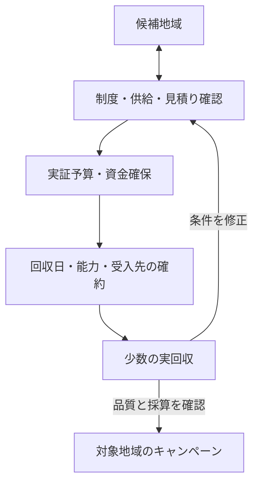

# 地域実証・引越し期キャンペーンの実行案

- 記録日：2026-10-04（日本時間）
- 原案：品川
- 位置づけ：本人が[前回フィードバック](2026-10-04-go-to-market-review.md)に全面的に賛同したうえで提示した実行案。今回のレビューは追加提案として区別する。
- 関連：[届け方の指針](2026-10-04-go-to-market-principles.md)／[Notes](index.md)

## 本人の原文

### 1. 地域の選定

引越しシーズンの2、3月ら辺に大々的にキャンペーンを打とうと考えています。不用品回収キャンペーンです。というより捨てたいものガンガン募集しますよキャンペーン。地域は今は考えていますが、「学生が多い街」「引越し頻度の多い街」「人口がいちばん多い街」「港区←これは俺が住んでいるので」とか。で、あなたの助言通り、自治体や管理会社との提携は「基本的に紹介してもらう事」とします。※中には全面的に困ってますので使わせてください！と言う人がいれば勿論使ってもらうけど、基本的には紹介。

### 2. 料金表や法律の確認、市へのアポイントメント

先に述べるが回収自体は、オファーをして業者にやってもらいます。働いて頂く以上、オファーをするのは当然かと思いました。（その為にも後述しますが、投資家や銀行から資金が必要です。）
その上でその市での回収ルール、また、私たちのような民間が回収してもいいケース、グレーケースなどを聞きます。またこの段階で廃棄OKな業者とかいたら紹介してもらいます。手順的にはどちらかというと、1と2を繰り返して磨いていく感じになるかと思います。これと同時に、ユーザー向けの使いやすさやシンプルさを整えていきます。

### 3. 投資家への依頼

実験期とその後の事業プランを考えます。そして、主に実験期で利用するお金（回収業者への依頼料やシステム運用費など必要なお金を伝えます。）投資家へアポイントをとり、投資の依頼を行います。

### 4. 回収業者への通知

このアプリを入れておけば「オファーがきますよ」という通知をしておく。事前ルールとかを整えて伝えておきます。

### 5. リリースとキャンペーンの開始

大々的にリリースとキャンペーンを開始します。

## レビューと修正提案

基本の運びに賛成する。地域選定と制度確認を反復し、紹介を入口に、回収に対価を払って事業を成立させる。変更を勧めるのは「業者相談の前倒し」「必要資金の算定」「キャンペーン前の実回収」の三点。

原文には年の指定がない。以下の日程案は、記録日から次の引越し期である2027年2〜3月を想定する。公開日を確約するものではない。

### 地域は、需要と実行できる条件を合わせて選ぶ

人口だけでは予約が集まるか分からない。学生が多い地域も、転居期限や品目、支払える価格帯を調べる必要がある。候補は同じ基準で比較する。

| 観点 | 確認すること |
|---|---|
| 需要 | 処分予定の世帯、時期、品目、既存手段で困る点 |
| 紹介 | 管理会社等が、どの建物・何世帯に、いつ案内できるか |
| 回収 | 対象地域・品目を扱う主体、稼働日、車両・人員、一便の能力 |
| 受入先 | 搬入できる品目・主体、費用、時間、数量、拒否条件 |
| 運営 | 現地へ行きやすさ、住宅の密度、搬出・駐車・移動の負担 |

港区は、本人が現地を観察し、ヒアリングやトラブル対応に行きやすい点で、比較の第一候補にする価値がある。人口や転居率で最適と確認したという意味ではない。区全域より、隣接する町丁目や数棟から範囲を決める案を推奨する。

### 自治体確認と、業者・受入先への相談を同時に進める

「グレーでも可能か」ではなく、具体的な体制図・料金案を示して、成立する条件と確認が残る点を明らかにする。家庭の廃棄物回収には原則として市区町村の許可・委託等の根拠が必要であり、アプリへの登録や通常の運送資格で代替できない。[1]

自治体への質問は、次の内容に絞って持ち込む。

- この地域・品目・排出元について、誰が収集運搬・処分を担えるか。家庭系と事業系を区別する。
- 利用者、RG、回収主体の契約・決済・責任分担はどう組めるか。再委託や紹介の取扱いも含む。
- 料金の各項目に適用される規定と、搬入可能な施設・条件は何か。
- 対象業務を確認できる許可業者一覧や相談先はあるか。
- 住民への案内に協力してもらう場合の条件は何か。紹介・掲載と、自治体による推奨・業務委託を区別する。

港区の粗大ごみ案内には許可業者と清掃事務所への案内がある。[2] 名簿掲載だけで今回の家庭系品目すべてに対応できると判断せず、実際の対象業務を確認する。相談結果は、確認日・担当部署・示した業務範囲・回答・根拠資料を記録する。具体的な契約・料金の解釈が残る部分は当該分野の専門家にも確認する。

業者には、資金調達前に見積りと協力意向を確認する。この段階では「資金確保等を条件とした相談」と明示し、確約済みと見込額を区別する。正式発注と日程・能力の確約は資金を確保してから行う。オファーは有償の業務依頼を意味し、報酬を競り上げる仕組みの導入まで自動的に意味するものではない。

### 資金調達は、実証で何を確認するかから必要額を出す

回収に対価を払うことと、外部調達が必須であることは別。利用者からの入金、業者への支払日、返金に備える資金を含めて、最大の資金不足額を見積もる。

実証計画には、地域・期間・回収回数・件数上限、価格、業者見積り、システム費、告知費、保険等の必要費用、予備費、終了時の未払・返金対応を記載する。少数受注・計画通り・満枠の各ケースを作り、追加投入できる自己資金と損失上限も決める。前払いの利用料金を全額自由に使える資金とは扱わない。

外部資金は手段を比較する。日本政策金融公庫には創業時の設備・運転資金を対象とする制度があるが、計画書の確認と審査があり、利用や入金時期は未確定。[3] 融資は返済原資、株式出資は持分・経営への関与・成長方針の合意を検討する。借入を無条件に優先する提案ではない。

投資家に対しては「費用がかかるので支援してほしい」に加え、「この予算で地域の予約密度・回収品質・一便の採算を確認し、成立すればどの条件で次の地域に展開するか」を説明する。ユーザー価値を優先する方針と、その検証に必要な資金を受けることは両立する。資金提供者との成長方針や契約条件を合わせる。

### 業者への通知から、実行できる枠の確保まで進める

「アプリを入れればオファーが届く」は候補業者を集める入口。キャンペーン前には、対応日、最低報酬、件数・容積・重量・作業時間の上限、二人作業の条件、キャンセル、当日欠員、搬入拒否時の対応、支払日を合意する。

予約上限は登録業者数ではなく、確保できた車両・作業員・受入先から算定する。一台一便に載る量と、時間内に処理できる量の両方を見る。

### キャンペーンは、少数の実回収で確かめてから広げる

国土交通省は3〜4月の引越し集中と車両・ドライバー確保の難しさを案内している。[4] これは引越し業の資料で、回収業者すべての繁忙を実証したものではない。今回使う人員・車両も確保しづらくなる可能性として、見積りと稼働確認に織り込む。

準備日程の提案は、2026年10〜11月に地域・制度・見積り・紹介経路を確認し、12月〜2027年1月に資金・発注・少数の実回収を成立させ、2〜3月に対象地域の告知を拡大する流れ。金融機関や投資家の判断期限を保証する日程ではない。資金・体制が揃わない場合は規模や開始日を調整する。

「大々的な告知」と「上限なしの受付」は分ける。対象区域では十分に知ってもらいながら、対象品目・総額・数量・回収枠を明示し、満枠は受付停止または予約と区別した待機登録にする。「ガンガン募集」の表現が、何でも・無料で・必ず回収するという誤認につながらないようにする。

先行回収では、予約から入金・搬出・搬入・完了通知まで一巡させる。未回収、遅延、想定外費用、問い合わせ、所要時間、一便の採算を確認する。割引を行う場合は通常料金と割引原資を記録し、割引後の需要だけで通常価格の需要を判断しない。引越し期の結果に加え、閑散期の需要も確認して通年運行を判断する。

## 参照資料

確認日：2026-10-04。

1. [環境省：無許可の廃棄物回収業者に関する案内](https://www.env.go.jp/recycle/kaden/tv-recycle/qa.html)
2. [港区：粗大ごみの出し方](https://www.city.minato.tokyo.jp/unei/kurashi/gomi/kate/sodai/)
3. [日本政策金融公庫：新規開業・スタートアップ支援資金](https://www.jfc.go.jp/n/finance/search/01_sinkikaigyou_m.html)
4. [国土交通省・関東運輸局：引越時期の分散に向けたお願い](https://wwwtb.mlit.go.jp/kanto/jidou_koutu/kamotu/arekore/bunsan.htm)
